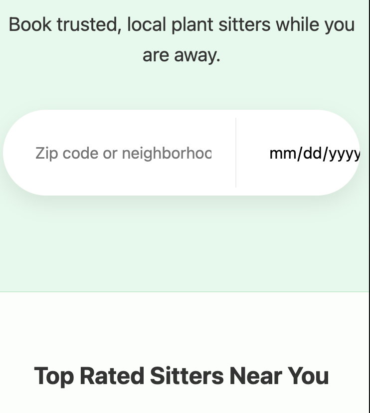
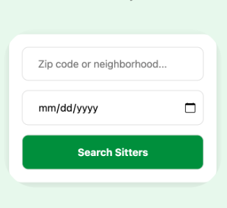

# Cross-Browser Compatibility Report
## Component Tested: Date Input (Sitter Booking Search)

## Browsers & Devices:
- Chrome (Blink)
- Firefox (Gecko)
- Safari (WebKit)

## Issue Summary:
The calendar icon was missing entirely in Safari, and clicking the custom icon in other browsers failed to trigger the date picker.

## Detailed Analysis of Key Issue:
- **Description:** Missing interactive calendar indicator in Safari.
- **Root Cause:** Safari hides the default `::-webkit-calendar-picker-indicator` by default, whereas Firefox shows it.
- **AI Explanation:** The browser engines use different User Agent stylesheets. By adding a custom background-image, I ensured visual parity, but had to stretch the invisible native "hitbox" to make the icon clickable.
- **The Fix:** Used absolute positioning on the pseudo-element with 0 opacity to cover the entire input area.

## Final Compatibility Status:
| Browser | Status | Notes |
| :--- | :--- | :--- |
| Chrome | Resolved | Single icon, fully clickable. |
| Firefox | Resolved | Native duplicate hidden, custom icon clickable. |
| Safari | Resolved | Custom icon visible and triggers system picker. |

## Detailed Analysis of Mobile Issue
- **Description:** Search button overflowed the viewport on mobile devices.
- **Root Cause:** A horizontal flex layout was too wide for small screens (375px-414px).
- **Fix:** Added a CSS Media Query (@media max-width: 600px) to switch `flex-direction` to `column`.
- **Validation:** Verified on iPhone 12 Pro emulator; all elements are now visible and clickable.

## Final Recommendations
- **Future testing:** Always test new UI components in "Responsive Mode" immediately after building.
- **Maintainability:** Use relative units (like % or fr) instead of fixed pixels where possible to avoid overflow.

### Visual Evidence

**1. Safari Calendar Bug (Before Fix):**

